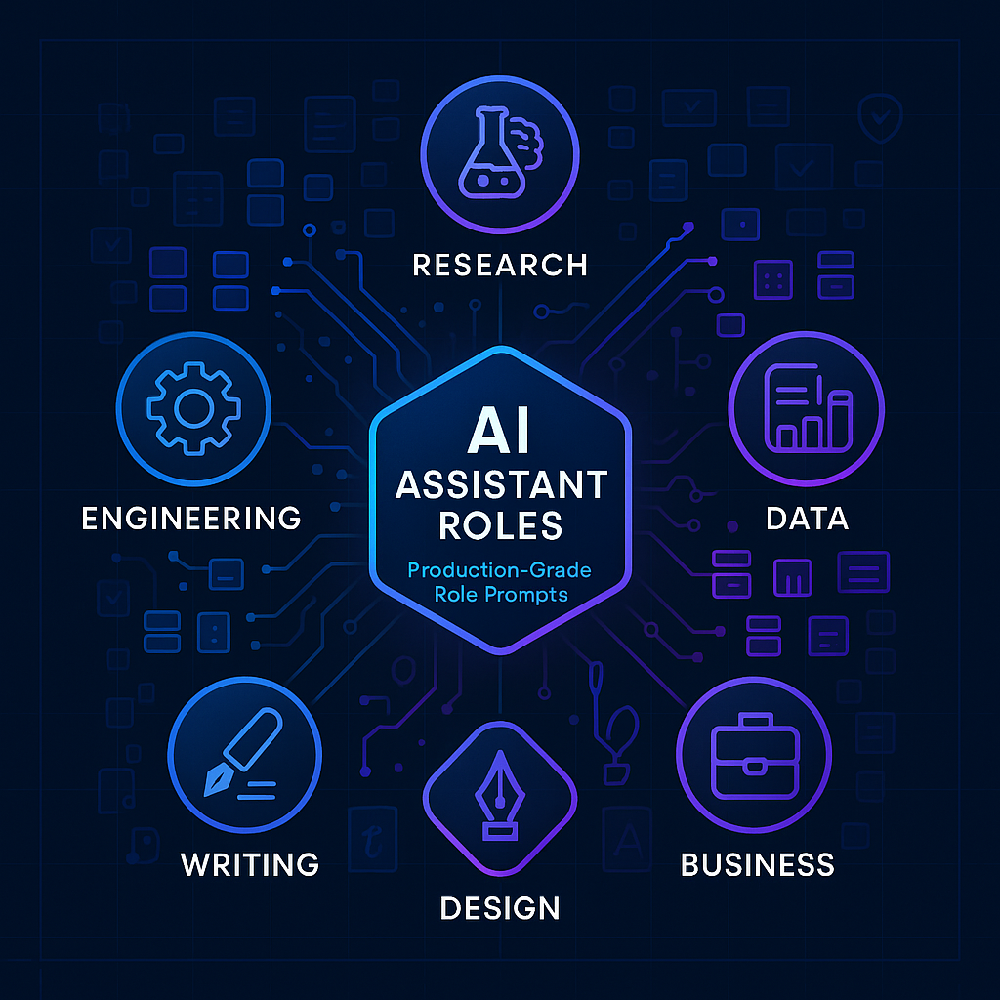

# AI Assistant Roles

**Production-Grade AI Assistant Prompts** - Role definitions for building structured AI engineering workflows. Transform generic AI interactions into specialized, domain-expert consultations.

<div align="center">
  
</div>

📚 **Learn the methodology: [The Role-Driven AI Engineering Workflow](https://aienhancedengineer.substack.com/p/the-role-driven-ai-engineering-workflow)** - Deep dive into building your AI engineering team.
## What This Repository Provides

- **23 specialized role prompts** across 6 professional domains
- **Structured organization** by domain expertise
- **Version-controlled** prompt evolution
- **Ready-to-use** with Claude Projects, ChatGPT, or any LLM
- **Production-tested** in real environments

## Quick Start

### Using with Claude Projects
1. Create a new Project in Claude
2. Copy your chosen role from `ai_assistant_roles/roles/`
3. Add it to the Project's custom instructions

### Using with ChatGPT
1. Open ChatGPT settings → Customize ChatGPT
2. Copy your chosen role prompt
3. Paste into "How would you like ChatGPT to respond?"

### General Usage
1. Browse the `ai_assistant_roles/roles/` directory
2. Copy any role prompt
3. Use as system prompt in your preferred AI assistant

## 📚 Available Roles

### Engineering (10 roles)
- `software-engineer` - Full-stack software development expertise
- `backend-engineer` - Backend systems and API development
- `frontend-engineer` - UI/UX and frontend technologies
- `ai-engineer` - AI/ML engineering and implementation
- `ai-product-engineer` - AI-powered product development
- `software-architect` - System design and architecture
- `systems-architect` - Infrastructure and distributed systems
- `devops-engineer` - CI/CD, automation, and operations
- `qa-tester` - Quality assurance and testing
- `code-reviewer` - Code review and best practices

### Research (6 roles)
- `research-engineer` - Applied research and implementation
- `deep-learning-researcher` - Neural networks and deep learning
- `language-model-expert` - LLMs and NLP expertise
- `multimodal-researcher` - Vision, audio, and multimodal AI
- `novel-techniques-researcher` - Cutting-edge AI research
- `statistical-ml-researcher` - Statistical machine learning

### Data (2 roles)
- `data-scientist` - Data analysis and machine learning
- `data-analyst` - Data exploration and insights

### Business (1 role)
- `product-manager` - Product strategy and management

### Design (1 role)
- `ux-designer` - User experience and interface design

### Writing (3 roles)
- `writing-assistant` - General writing support
- `linkedin-writer` - Professional LinkedIn content


## Project Structure

```
ai-assistant-roles/
├── ai_assistant_roles/      # Main directory
│   ├── __init__.py         
│   ├── prompts.py          # Prompt utilities
│   └── roles/              # Role definitions by domain
│       ├── business/       # Business-focused roles
│       ├── data/          # Data science roles
│       ├── design/        # Design roles
│       ├── engineering/   # Software engineering roles
│       ├── research/      # Research roles
│       ├── writing/       # Writing roles
│       └── INTEGRATION.md # Integration patterns guide
├── tests/                  # Test suite
├── Makefile              # Development automation
├── pyproject.toml        # Configuration
└── CLAUDE.md             # Development guidelines
```

## Development

### Adding New Roles

1. Create a new markdown file in the appropriate `roles/` subdirectory
2. Follow the existing prompt structure:
   - Role description and expertise
   - Communication style
   - Solution approach
   - Key principles
3. Test the prompt with various queries
4. Submit a pull request

### Development Commands

```bash
make environment-create   # Create Python environment
make validate-branch      # Run all checks before committing
make all-test            # Run complete test suite
```

## Contributing

We welcome contributions! When creating new role prompts, follow this structure:

### Prompt Structure Template

```markdown
# Role Name

[Opening paragraph with experience level and key characteristics]

## Core Expertise
- [6-8 specific areas of expertise]
- [Include technologies and methodologies]
- [Mix technical and strategic capabilities]

## Communication Style
- [How the assistant communicates]
- [Tone and approach]
- [Audience handling]

## When Providing Solutions
1. [Step 1 of approach]
2. [Step 2 of approach]
3. [Continue for 6-8 steps total]

## Key Principles
- [Core guiding principles]
- [Best practices]
- [Balance theory with pragmatism]
```

### Guidelines
- Use kebab-case for filenames (e.g., `data-engineer.md`)
- Place in the appropriate domain subdirectory
- Ensure the role is distinct from existing ones
- Test the prompt with various queries before submitting

### Contribution Ideas

- New specialized roles for emerging domains
- Improvements to existing prompts based on real-world usage
- Integration examples with different frameworks
- Documentation improvements

## Related Resources

- [The Role-Driven AI Engineering Workflow](https://aienhancedengineer.substack.com/p/the-role-driven-ai-engineering-workflow) - Complete methodology
- [AI Enhanced Engineer Newsletter](https://aienhancedengineer.substack.com/) - AI engineering insights
- [FM App Toolkit](https://github.com/ai-enhanced-engineer/fm-app-toolkit) - Foundation model application patterns

## License

Apache License 2.0 - See [LICENSE](LICENSE) file for details.

---

🚀 **Ready to build your AI engineering team?** Transform your AI interactions into structured, professional consultations.